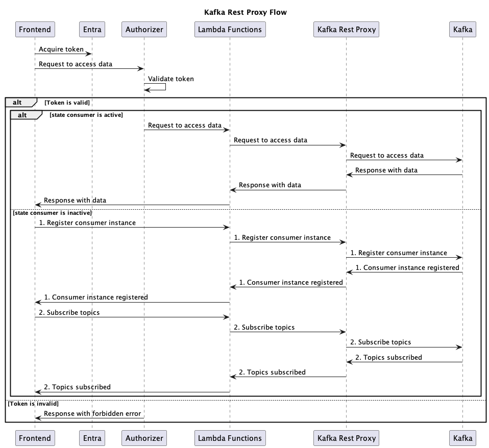

# React Kafka REST Proxy
This is an example implementation of Kafka REST Proxy with Publisher/ Subscriber client using React (Frontend) and SpringBoot (Backend).

## Application Flows
- Frontend will pub/sub through Kafka REST proxy.
- Frontend must be authenticated via Microsoft Entra before doing pub/sub.
- API to Kafka REST Proxy may be different. In this Repository, API Gateway and Lambda Function are used to communicate to Kafka REST Proxy
- Backend will pub/sub through kafka directly.
- Backend does not need to authenticate to communicate with kafka.

## Diagram Flows

## Reference
Full Stack Docker Compose Configuration Provided by [Conductor](https://github.com/conduktor/kafka-stack-docker-compose)